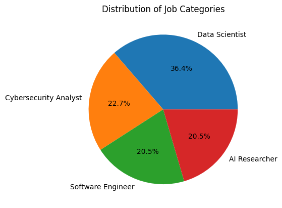

# 🤖 AI Job Market Insights: A Data Analysis Project

📊 **A project that explores insights from the AI job market using data visualization and summary statistics.**

---

## 📂 Dataset Description

- **Dataset file:** `ai_job_market_insights.csv`
- **Rows:** 44
- **Columns:** 5
- **Source:** [Kaggle - AI-Powered Job Market Insights](https://www.kaggle.com/datasets/uom190346a/ai-powered-job-market-insights)

---

## 🔍 Methodology

This project involves:

1. 📈 Data visualization:
   - Bar chart for **Top 20 Salaries by Job Title**
   - Pie chart for **Distribution of Job Categories**

2. 📊 Data analysis:
   - Summary statistics using `pandas.describe()`

---

## 📈 Visualizations

### 🪙 Salary Bar Chart
Top 20 job titles with highest salaries (with domain info):

---

### 🧠 Distribution of Job Categories

A pie chart showing how AI job categories are distributed:

---

## 🧪 Results Summary

- **Salary Insights:**
  - Shows which job titles and domains have higher salary ranges
- **Job Categories:**
  - Distribution across different AI fields
- **Summary Stats:**
  - Mean, median, and standard deviation of salary data

---

## 💻 Tools Used

- `pandas` → Data loading, cleaning, analysis
- `matplotlib` → Chart visualization
- Python 3.10+ / Jupyter Notebook

---

## 📁 Code Sections

- 📥 Data loading & cleaning
- 📊 Data visualization
- 📈 Summary analysis

> 📌 All code is included in `AI_Job_Analysis.ipynb`

---

## ✅ Conclusion

This project offers a concise and visual look into the **AI job market landscape**, providing useful insights for job seekers, employers, and researchers in tech fields.

---

## 📚 References

- Kaggle Dataset: [AI-Powered Job Market Insights](https://www.kaggle.com/datasets/uom190346a/ai-powered-job-market-insights)

---

### 👩‍💻 Created by Atika Arifiana  
🔗 [LinkedIn](https://linkedin.com/in/atika-arifiana) | [GitHub](https://github.com/atikfriana) | [Portfolio](https://bit.ly/PortfolioAtikaArifiana)
